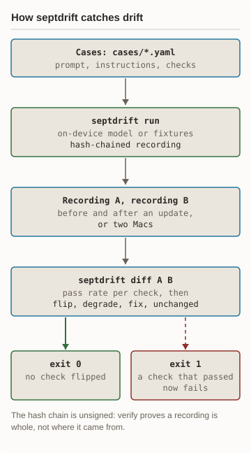
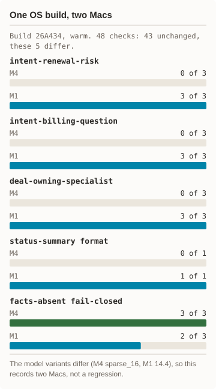
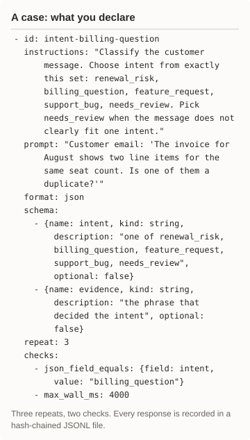
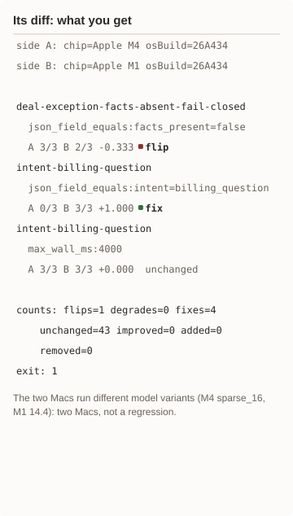

# septdrift

Catches drift in Apple Foundation Models behavior across macOS updates.
You declare cases with checks, the CLI records every response as a
hash-chained receipt, and `diff` scores two recordings against each other.
It exits 1 when a check that passed now fails. The on-device model changes
every September; septdrift tells you what your feature lost.

## Status

Spec v0.3.8. 136 tests pass on the fixture backend with no model calls
(`./scripts/test.sh`). Requires macOS 27.0 or later and Swift 6; Command Line
Tools are enough. Live runs need Apple Intelligence on; fixture runs need
nothing. Measured once on two Macs, below.

## Measured results

<p align="center"><picture><source media="(prefers-color-scheme: dark)" srcset="docs/diagrams/flow-dark.svg"/></picture> <picture><source media="(prefers-color-scheme: dark)" srcset="docs/diagrams/measured-dark.svg"/></picture></p>

<details><summary>Text version of the diagrams</summary>

You declare cases with checks in `cases/*.yaml`. `septdrift run` sends each
case to the on-device model and writes a hash-chained recording whose header
names the chip, OS build, and model asset IDs. Record once before an OS
update and once after, or on two Macs. `septdrift diff` scores both
recordings check by check and classes each as flip, degrade, fix, or
unchanged. It exits 0 when nothing flipped and 1 when a check that passed
now fails.

One OS build, 26A434, on an M4 and an M1, warm. 48 checks: 43 unchanged, 4
pass only on the M1, and 1 passes less on the M1. intent-renewal-risk,
intent-billing-question, and deal-owning-specialist: M4 0 of 3, M1 3 of 3.
status-summary format: M4 0 of 1, M1 1 of 1. The facts-absent fail-closed
check: M4 3 of 3, M1 2 of 3. The two Macs run different model variants (M4
sparse_16, M1 14.4), so this records two Macs, not a regression.

</details>

The receipt is
[docs/runs/2026-09-30-m4-vs-m1.txt](docs/runs/2026-09-30-m4-vs-m1.txt).

## How it works

<p align="center"><picture><source media="(prefers-color-scheme: dark)" srcset="docs/diagrams/case-file-dark.svg"/></picture> <picture><source media="(prefers-color-scheme: dark)" srcset="docs/diagrams/diff-output-dark.svg"/></picture></p>

<details><summary>Text version of the case and its diff</summary>

The case `intent-billing-question` in `cases/semi-deterministic.yaml` asks
the model to classify a billing email into one of five intents, as JSON with
the fields intent and evidence, three times. Its checks:
`json_field_equals` intent is `billing_question`, and `max_wall_ms: 4000`.

The diff rows are the receipt's, wrapped for a phone, with the rate beside
each count left out. Side A is the Apple M4 and side B the Apple M1, both on
26A434. deal-exception-facts-absent-fail-closed,
`json_field_equals:facts_present=false`: A 3/3, B 2/3, -0.333, flip.
intent-billing-question, `json_field_equals:intent=billing_question`: A 0/3,
B 3/3, +1.000, fix. intent-billing-question, `max_wall_ms:4000`: A 3/3, B
3/3, unchanged. Counts: flips=1, degrades=0, fixes=4, unchanged=43. Exit 1.

</details>

- **Cases** are YAML: an id, instructions, a prompt, an optional output
  schema, a repeat count, and checks.
- **Checks:** `contains`, `not_contains`, `regex`, `json_field_equals`,
  `json_field_in`, `json_field_range`, `json_field_rank` (bounds on an
  ordered ladder), `max_wall_ms`, `max_output_tokens`, `expect_error`.
- **Recordings** are JSONL, one hash-chained record per result. The header
  names the chip, OS build, and model asset IDs, so a flip is attributable.
- **`diff`** prints one row per check with the pass rate on each side and a
  class, then exits 1 on a flip.

Commands:

- `run <cases> --backend system|fixture`: run every case, write one
  recording. A live run makes one unrecorded warm-up call first.
- `verify <recording>`: recompute the hash chain and the result count.
- `diff <a> <b>`: score B against A; `--json` for machines.
- `cases <file-or-dir>`: validate case files and list what they declare.

Format and semantics: [SPEC.md](SPEC.md). Agent use: [AGENTS.md](AGENTS.md).

## Quick start

```bash
# Build. Command Line Tools suffice.
swift build -c release
B=.build/release/septdrift

# Record two fixture runs. No model.
$B run cases/day2.yaml \
  --backend fixture \
  --fixtures fixtures/side-a.jsonl \
  --out a.jsonl
$B run cases/day2.yaml \
  --backend fixture \
  --fixtures fixtures/side-b.jsonl \
  --out b.jsonl

# Score B against A. Exits 1:
# side B flips five checks.
$B diff a.jsonl b.jsonl
```

## Measured run

A live recording calls the on-device model, so it needs Apple Intelligence
on. Record one on each Mac or each OS build, then diff them.

```bash
# Record every case on this Mac.
$B run cases/ --backend system \
  --out recordings/$(hostname -s).jsonl

# Check the chain is whole.
$B verify recordings/*.jsonl
```

For a second Mac, `scripts/pack.sh` makes a tarball under 100 KB. On that
Mac, `scripts/mini-run.sh` builds, runs every case, verifies, and leaves one
recording on the Desktop, or in `SEPTDRIFT_OUT_DIR` when set.

## Known gaps

- The hash chain is unsigned. `verify` proves a recording is internally
  consistent, not where it came from; anyone can rewrite a whole file and
  re-seal it. Signing is a non-goal in v0.3.
- One measured comparison, on two Macs. It is a record of that run, not a
  benchmark of the chips or the model.
- CI runs the fixture tests only. A live recording is meaningful only on
  the target Mac, never on a CI runner.

## More

- [SPEC.md](SPEC.md): case format, recording format, checks, diff classes.
- [AGENTS.md](AGENTS.md): exit codes and how an agent should use the CLI.
- [docs/septdrift-use-cases.html](docs/septdrift-use-cases.html): where
  drift checks pay off.

## License

MIT. See [LICENSE](LICENSE).
